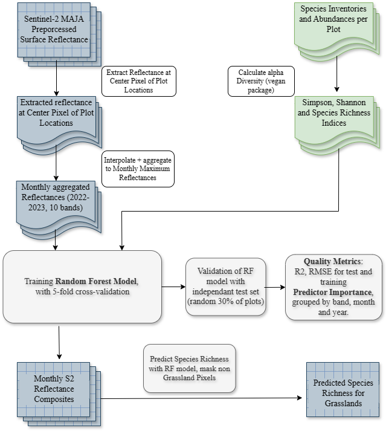

<!-- README.md is generated from README.Rmd. Please edit that file -->

```{r, include = FALSE}
knitr::opts_chunk$set(
  collapse = TRUE,
  comment = "#>",
  fig.path = "man/figures/README-",
  out.width = "70%"
)
```

# gRasslands <a href="https://www.susalps.de/en/">


<!-- badges: start -->
<!-- badges: end -->

`gRasslands` is part of the SUSALPS research project (https://www.susalps.de/en/), which is researching the sustainable use of alpine and pre-alpine grasslands in Southern Germany. A key indicator of ecosystem health is the floral biodiversity, which can be measured through indices like the species number or the shannon and simpson index (webpage with explanation?). The goal of this project was to estimate floral diversity at the help of Sentinel-2 reflectances between 2022 and 2023.
This package provides the functions and code used to train a random forest model with the extracted reflectances at the sample plot locations. Species inventories sampled in the same plots served as response variable.
Parts of the data are also available through this package.

## 0. Installation

You can install the development version of gRasslands via `devtools`:

``` r
devtools::install_github("Siedrid/gRasslands")
```

## I. Data Preprocessing

In this section you find documentation how your data needs to be preprocessed to train your random forest model. This is shown at the hand of Sentinel-2 surface reflectances extracted at 60 plot locations in Lower Franconia, Bavaria. The Sentinel-2 scenes were atmospherically corrected using the MAJA processor (https://www.cesbio.cnrs.fr/maja/). For some areas Sentinel-2 L2A products (MAJA preprocessed) are freely distributed on the THEIA portal: https://theia.cnes.fr/atdistrib/rocket/#/search?collection=SENTINEL2
Of course, also the Sentinel-2 L2A products distributed via the Copernicus Browser or the Google Earth Engine are suitable for this analysis.

```{r refl.df}
library(gRasslands)

summary(refl.df)

```

Reflectances at the plot locations and in each Sentinel-2 band from 2022 to 2023 were already extracted and are stored in the `refl.df` data frame. The `refl.df` data frame has a column for each Sentinel-2 band, and two additional columns for the plot names and date of the Sentinel-2 acquisition. You can find the code to create this data frame in `data-raw/refl.df.R`. The functions used in the refl.df.R script are also provided within this package. In the following the `refl.df` data frame is brought into the right form to be processed in the random forest model.

```{r refl.df 2}
int.ts <- interpolate.ts(refl.df, plot.column = "plot_names") # interpolate missing values
int.ts <- na.omit(int.ts)
monthly_max.df <- comp_monthly(int.ts, date.column = "dat", stat = "min") # composite to monthly maximum reflectances
monthly_max.df.piv <- pivot.df(monthly_max.df) # pivot the data into wide table

```

In the next step we take a look at the response variable: the alpha-diversity indices. Species inventories were collected in the same 60 plots in May 2022 and April 2023. Both datasets are processed together in step II. With `get_cover`, the cloud cover, i.e. the percentage of the masked area of one acquisition inside the study area is returned. With `plt.band_composite`, an RGB band composite of the study area can be plotted and the plot locations added.

```{r div.df}
summary(div.df)

study_area <- get_study_area(div.df, "X", "Y")
div.sf <- div2sf(div.df, x.column = "X", y.column = "Y", epsg.code = 25832, write = F)

acq <- get_acquisitions("2022", "04", "E:/Grasslands_Biodiv/Data/SatData/")[1]
cloud_cover <- get_cover(acq, study_area) # calculate cloud cover

plt.band_composite(acq, bands = c("B2", "B3", "B4"), study_area, df = div.df, add.plots = T)

```

The alpha diversity indices used are the species number, shannon and simpson index. Many studies have shown, that species number is the best response variable, therefore this alpha-diversity indice will be used in the following random forest model. The code to calculate these indices is provided in the `data-raw` folder.


## II. Train and Test Random Forest

For the training, only the maximum reflectances from the months March to September are used. The winter months are influenced by clouds and snow and are limited by less plant growth/cover, which could potentially impact our results negatively.

```{r Random Forest}
s = 91
biodiv_ind = "specn"

m.nowinter <- c("03$", "04$", "05$", "06$","07$", "08$", "09$")
data_frame.nowinter <- RF_predictors(monthly_max.df.piv, m.nowinter) # use only months from March to September
rf_data <- preprocess_rf_data(data_frame.nowinter, div.df, biodiv_ind) # merge reflectance and alpha diversity dataframe

train_index <- get_train_index(rf_data, s = s) # split samples into training and testing (70:30)
forest <- RF(rf_data, train_index = train_index, s = s) # train Random Forest
print(forest)
```

In the output of the `forest` variable, it is summarized that 43 samples were used for the training (i.e. 70% of the dataset) and 140 predictors (i.e. 10 bands x 2 years x 7 months). Per default a cross-validation with 10 folds and 5 repeats is used. The forest with the highest R2 and the lowest RMSE is returned in the end.
Training and testing results are visualized in a scatter plot with the actual species number on the x-axis and the predicted species number on the y-axis. Further statistics can be summarized in a csv file with the function `write.RF`. This function is especially usefull, when testing different compositing methods, and month combinations or running the model multiple times with different seeds.

```{r Random Forest 2}
RF.summary(forest, rf_data, div.df, train_index, "specn", plot_labels = F) # returns scatter plot
#write.RF("no winter", "specn", forest, 10, csv.path)
```

Species Numbers between 20 and 40 have the highest accuracy. Lower and higher species numbers are over and underestimated, respecitively, due to the limited sample number with these numbers. The R2 is given for the training and testing split. The testing split was not used to train the random forest model.
With `plot_labels = T`, the points are labeled according to their plot names.

```{r Variable Importance}

plt.varimp(forest)

```

`plt.varimp` is an important function to evaluate the predictors according to their band, year and month. The SWIR bands and B4 and B5 are the most important Sentinel-2 bands (A). March is by far the most important month in the prediction (D).

## III. Spatial Prediction of Alpha-Diversity

For the spatial prediction, all variables, that trained the random forest, need to be stacked to a spatial Raster, on which the species number can be predicted. In the case of the random forest trained with all summer months, the monthly maximum raster composites of all acquisitions from March until September 2022 and 2023 respectively need to be calculated first. Due to the limited storage capacity, these raster composites can't be part of this package. The code to calculate these raster composites is provided in the `data-raw` folder. On request, we can make these composites available. The code to calculate spatial predictions is provided in the following.

```{r Spatial Prediction Preprocessing}

# select months as predictors 
m <- c("03.tif", "04.tif", "05.tif", "06.tif","07.tif", "08.tif", "09.tif")
comp_path <- "E:/Grasslands_BioDiv/Data/S2_min_composites"
fls <- list_comp_months(comp_path, m)

max.brick <- stack_S2_months(fls, comp_path)

s2_pred <- terra::predict(max.brick, model = forest, na.rm = T)

# Mask non-Grasslands with Copernicus Grassland Layer
grass.mask.path <- "E:/Grasslands_BioDiv/Data/Copernicus_Grassland/GRA_2018_010m_03035_V1_0.tif"
grass.mask <- terra::rast(grass.mask.path)

s2_pred.masked <- mask.grasslands(s2_pred, grass.mask)

plt.diversity(s2_pred.masked, biodiv_ind = "specn")

```

`comp_path` is the path to the directory, where the monthly raster composites are stored. After creating a list of these raster composites, the rasters are stacked with the terra package and then transformed into a brick object. With `predict`, the random forest model `forest` is applied to the brick.

## IV. Further Resources

In the following, the entire workflow of the analysis is visualized. This package was designed to encourage a similar analysis at grassland sites, where species inventories are available. A valuable database for such inventories and environmental parameters is also the Biodiversity Exploratories Information System: https://www.bexis.uni-jena.de/
This is an important step towards a broader understanding of grassland sites, how to manage them and protect their valuable ecosystem services.




### Literature:

### Contact Details:

Laura Obrecht: laura.obrecht@stud-mail.uni-wuerzburg.de

Dr. Sophie Reinermann: sophie.reinermann@dlr.de
