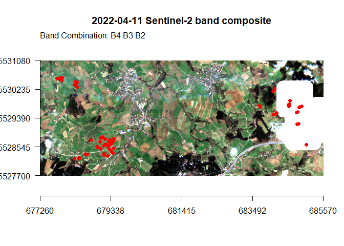
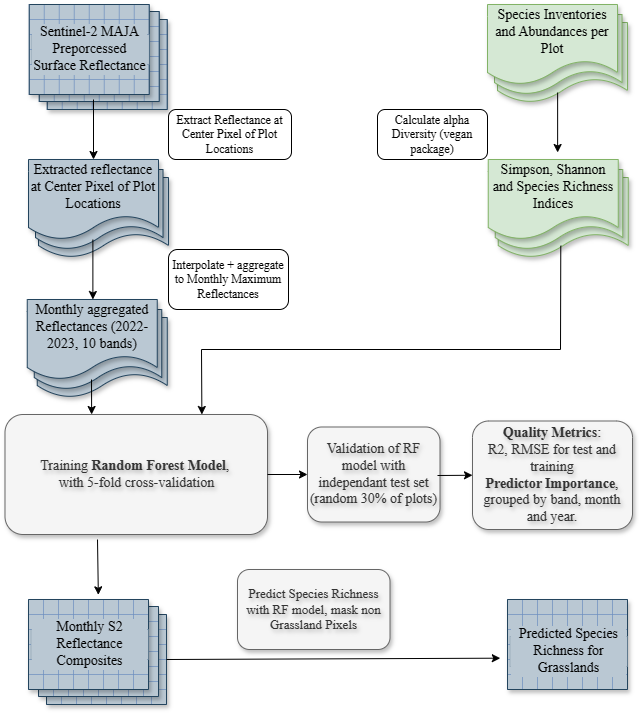

<!-- README.md is generated from README.Rmd. Please edit that file -->

# gRasslands <a href="https://www.susalps.de/en/">

<!-- badges: start -->
<!-- badges: end -->

`gRasslands` is part of the SUSALPS research project
(<https://www.susalps.de/en/>), which is researching the sustainable use
of alpine and pre-alpine grasslands in Southern Germany. A key indicator
of ecosystem health is the floral biodiversity, which can be measured
through indices like the species number or the shannon and simpson index
(webpage with explanation?). The goal of this project was to estimate
floral diversity at the help of Sentinel-2 reflectances between 2022 and
2023. This package provides the functions and code used to train a
random forest model with the extracted reflectances at the sample plot
locations. Species inventories sampled in the same plots served as
response variable. Parts of the data are also available through this
package.

## 0. Installation

You can install the development version of gRasslands via `devtools`:

``` r
devtools::install_github("Siedrid/gRasslands")
```

## I. Data Preprocessing

In this section you find documentation how your data needs to be
preprocessed to train your random forest model. This is shown at the
hand of Sentinel-2 surface reflectances extracted at 60 plot locations
in Lower Franconia, Bavaria. The Sentinel-2 scenes were atmospherically
corrected using the MAJA processor (<https://www.cesbio.cnrs.fr/maja/>).
For some areas Sentinel-2 L2A products (MAJA preprocessed) are freely
distributed on the THEIA portal:
<https://theia.cnes.fr/atdistrib/rocket/#/search?collection=SENTINEL2>
Of course, also the Sentinel-2 L2A products distributed via the
Copernicus Browser or the Google Earth Engine are suitable for this
analysis.

``` r
library(gRasslands)

summary(refl.df)
#>   plot_names              B2              B3              B4       
#>  Length:11248       Min.   :0.000   Min.   :0.000   Min.   :0.000  
#>  Class :character   1st Qu.:0.019   1st Qu.:0.052   1st Qu.:0.021  
#>  Mode  :character   Median :0.028   Median :0.061   Median :0.044  
#>                     Mean   :0.033   Mean   :0.064   Mean   :0.055  
#>                     3rd Qu.:0.046   3rd Qu.:0.074   3rd Qu.:0.084  
#>                     Max.   :0.180   Max.   :0.215   Max.   :0.242  
#>                     NA's   :8446    NA's   :8446    NA's   :8446   
#>        B5              B6              B7              B8       
#>  Min.   :0.009   Min.   :0.038   Min.   :0.051   Min.   :0.006  
#>  1st Qu.:0.093   1st Qu.:0.229   1st Qu.:0.263   1st Qu.:0.283  
#>  Median :0.111   Median :0.276   Median :0.321   Median :0.340  
#>  Mean   :0.117   Mean   :0.285   Mean   :0.340   Mean   :0.357  
#>  3rd Qu.:0.140   3rd Qu.:0.336   3rd Qu.:0.408   3rd Qu.:0.421  
#>  Max.   :0.281   Max.   :0.506   Max.   :0.675   Max.   :0.682  
#>  NA's   :8449    NA's   :8449    NA's   :8449    NA's   :8446   
#>       B8A             B11             B12             dat            
#>  Min.   :0.050   Min.   :0.006   Min.   :0.005   Min.   :2022-01-06  
#>  1st Qu.:0.307   1st Qu.:0.191   1st Qu.:0.083   1st Qu.:2022-06-16  
#>  Median :0.366   Median :0.225   Median :0.106   Median :2022-10-23  
#>  Mean   :0.382   Mean   :0.245   Mean   :0.127   Mean   :2022-12-07  
#>  3rd Qu.:0.447   3rd Qu.:0.293   3rd Qu.:0.166   3rd Qu.:2023-06-19  
#>  Max.   :0.712   Max.   :0.459   Max.   :0.287   Max.   :2023-12-05  
#>  NA's   :8449    NA's   :8449    NA's   :8449
```

Reflectances at the plot locations and in each Sentinel-2 band from 2022
to 2023 were already extracted and are stored in the `refl.df` data
frame. The `refl.df` data frame has a column for each Sentinel-2 band,
and two additional columns for the plot names and date of the Sentinel-2
acquisition. You can find the code to create this data frame in
`data-raw/refl.df.R`. The functions used in the refl.df.R script are
also provided within this package. In the following the `refl.df` data
frame is brought into the right form to be processed in the random
forest model.

``` r
int.ts <- interpolate.ts(refl.df, plot.column = "plot_names") # interpolate missing values
int.ts <- na.omit(int.ts)
monthly_min.df <- comp_monthly(int.ts, date.column = "dat", stat = "min") # composite to monthly minimum reflectances
monthly_min.df.piv <- pivot.df(monthly_min.df) # pivot the data into wide table
```

In the next step we take a look at the response variable: the
alpha-diversity indices. Species inventories were collected in the same
60 plots in May 2022 and April 2023. Both datasets are processed
together in step II. With `get_cover`, the cloud cover, i.e. the
percentage of the masked area of one acquisition inside the study area
is returned. With `plt.band_composite`, an RGB band composite of the
study area can be plotted and the plot locations added.

``` r
summary(div.df)
#>   plot_names           shannon          simpson           specn      
#>  Length:59          Min.   :0.8192   Min.   :0.2763   Min.   :15.00  
#>  Class :character   1st Qu.:1.9472   1st Qu.:0.7213   1st Qu.:27.00  
#>  Mode  :character   Median :2.3466   Median :0.8244   Median :32.00  
#>                     Mean   :2.3232   Mean   :0.7852   Mean   :32.44  
#>                     3rd Qu.:2.7362   3rd Qu.:0.8921   3rd Qu.:37.50  
#>                     Max.   :3.5101   Max.   :0.9529   Max.   :52.00  
#>        X                Y          
#>  Min.   :677759   Min.   :5528198  
#>  1st Qu.:678610   1st Qu.:5528541  
#>  Median :679250   Median :5528797  
#>  Mean   :680548   Mean   :5529222  
#>  3rd Qu.:684102   3rd Qu.:5529788  
#>  Max.   :685066   Max.   :5530580

study_area <- get_study_area(div.df, "X", "Y")
div.sf <- div2sf(div.df, x.column = "X", y.column = "Y", epsg.code = 25832, write = F)

acq <- get_acquisitions("2022", "04", "E:/Grasslands_Biodiv/Data/SatData/")[1]
cloud_cover <- get_cover(acq, study_area) # calculate cloud cover
#> Cloud Cover is 8.53%

plt.band_composite(acq, bands = c("B2", "B3", "B4"), study_area, df = div.df, add.plots = T)
```



    #> NULL

The alpha diversity indices calculated and provided in the `div.df` data
frame are the species number, shannon and simpson index. Many studies
have shown, that species number is the best response variable, therefore
this alpha-diversity indice will be used in the following random forest
model. The code to calculate these indices is provided in the `data-raw`
folder in the div.df.R script.

## II. Train and Test Random Forest

For the training, only the minimum reflectances from the months March to
September are used. The winter months are influenced by clouds and snow
and are limited by less plant growth/cover, which could potentially
impact our results negatively.

``` r
s = 91
biodiv_ind = "specn"

m.nowinter <- c(3:9)
data_frame.nowinter <- RF_predictors(monthly_min.df.piv, m.nowinter) # use only months from March to September
rf_data <- preprocess_rf_data(data_frame.nowinter, div.df, biodiv_ind) # merge reflectance and alpha diversity dataframe

train_index <- get_train_index(rf_data, s = s) # split samples into training and testing (70:30)
forest <- RF(rf_data, train_index = train_index, s = s) # train Random Forest
#> Lade nötiges Paket: ggplot2
#> Lade nötiges Paket: lattice
print(forest)
#> Random Forest 
#> 
#>  43 samples
#> 140 predictors
#> 
#> No pre-processing
#> Resampling: Cross-Validated (10 fold, repeated 5 times) 
#> Summary of sample sizes: 38, 38, 40, 39, 40, 38, ... 
#> Resampling results across tuning parameters:
#> 
#>   mtry  RMSE      Rsquared   MAE     
#>     2   5.212698  0.7680533  4.075929
#>    25   5.307270  0.7299904  4.297927
#>    48   5.341733  0.7183568  4.353222
#>    71   5.399386  0.7100851  4.409252
#>    94   5.439054  0.7046677  4.450530
#>   117   5.481573  0.6931790  4.479744
#>   140   5.470326  0.7015584  4.472773
#> 
#> RMSE was used to select the optimal model using the smallest value.
#> The final value used for the model was mtry = 2.
```

In the output of the `forest` variable, it is summarized that 43 samples
were used for the training (i.e. 70% of the dataset) and 140 predictors
(i.e. 10 bands x 2 years x 7 months). Per default a cross-validation
with 10 folds and 5 repeats is used. The forest with the highest R2 and
the lowest RMSE is returned in the end. Training and testing results are
visualized in a scatter plot with the actual species number on the
x-axis and the predicted species number on the y-axis. Further
statistics can be summarized in a csv file with the function `write.RF`.
This function is especially usefull, when testing different compositing
methods, and month combinations or running the model multiple times with
different seeds.

``` r
RF.summary(forest, rf_data, div.df, train_index, "specn", plot_labels = F) # returns scatter plot
```


``` r
#write.RF("no winter", "specn", forest, 10, csv.path)
```

Species Numbers between 20 and 40 have the highest accuracy. Lower and
higher species numbers are over and underestimated, respecitively, due
to the limited sample number with these numbers. The R2 is given for the
training and testing split. The testing split was not used to train the
random forest model. With `plot_labels = T`, the points are labeled
according to their plot names.

``` r

plt.varimp(forest)
```


`plt.varimp` is an important function to evaluate the predictors
according to their band, year and month. The SWIR bands and the bands in
the visible domain are the most important Sentinel-2 bands (A). March is
by far the most important month in the prediction (D).

## III. Spatial Prediction of Alpha-Diversity

For the spatial prediction, all variables, that trained the random
forest, need to be stacked to a spatial Raster, on which the species
number can be predicted. In the case of the random forest trained with
all summer months, the monthly minimum raster composites of all
acquisitions from March until September 2022 and 2023 respectively need
to be calculated first. Due to the limited storage capacity, these
raster composites can’t be part of this package. The code to calculate
these raster composites is provided in the `data-raw` folder in the
`comp.S2.bands.R` script. On request, we can make these composites
available. The code to calculate spatial prediction maps is provided in
the following.

``` r

# select months March to September as predictors 
comp_path <- "E:/Grasslands_BioDiv/Data/S2_min_composites"
fls <- list_comp_months(comp_path, m.nowinter)

min.brick <- stack_S2_months(fls)

s2_pred <- terra::predict(min.brick, model = forest, na.rm = T)
```

`comp_path` is the path to the directory, where the monthly raster
composites are stored. After creating a list of these raster composites,
the rasters are stacked with the terra package and then transformed into
a brick object. With `predict`, the random forest model `forest` is
applied to the brick. To mask non-grasslands, we used the High
Resolution Grassland Layer, provided by Copernicus
(<https://land.copernicus.eu/en/products/high-resolution-layer-grassland>).
We used the 2018 product with a 10m spatial resolution:

``` r
# Mask non-Grasslands with Copernicus Grassland Layer
grass.mask.path <- "E:/Grasslands_BioDiv/Data/Copernicus_Grassland/GRA_2018_010m_03035_V1_0.tif"
grass.mask <- terra::rast(grass.mask.path)

s2_pred.masked <- mask.grasslands(s2_pred, grass.mask)
#> |---------|---------|---------|---------|=========================================                                          |---------|---------|---------|---------|=========================================                                          

plt.diversity(s2_pred.masked, biodiv_ind = "specn")
```


## IV. Further Resources

In the following, the entire workflow of the analysis is visualized.
This package was designed to encourage a similar analysis at grassland
sites, where species inventories are available. A valuable database for
such inventories and environmental parameters is also the Biodiversity
Exploratories Information System: <https://www.bexis.uni-jena.de/> This
is an important step towards a broader understanding of grassland sites,
how to manage them and protect their valuable ecosystem services.



### Contact Details:

Laura Obrecht: <laura.obrecht@stud-mail.uni-wuerzburg.de>

Dr. Sophie Reinermann: <sophie.reinermann@dlr.de>
